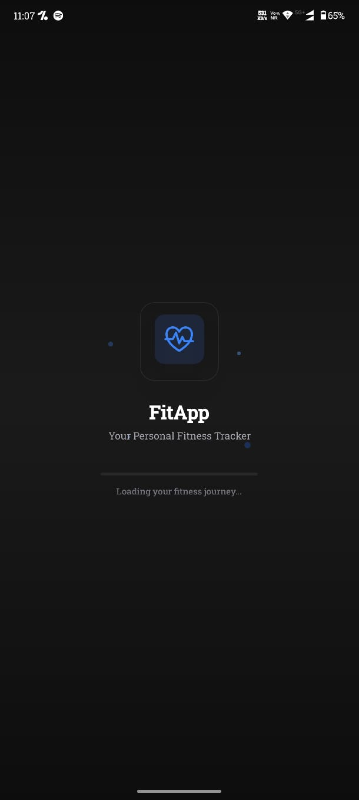
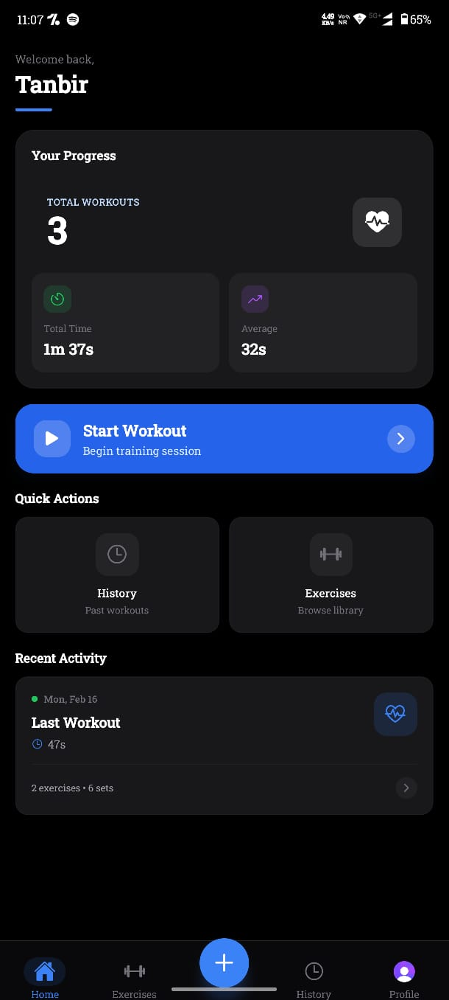
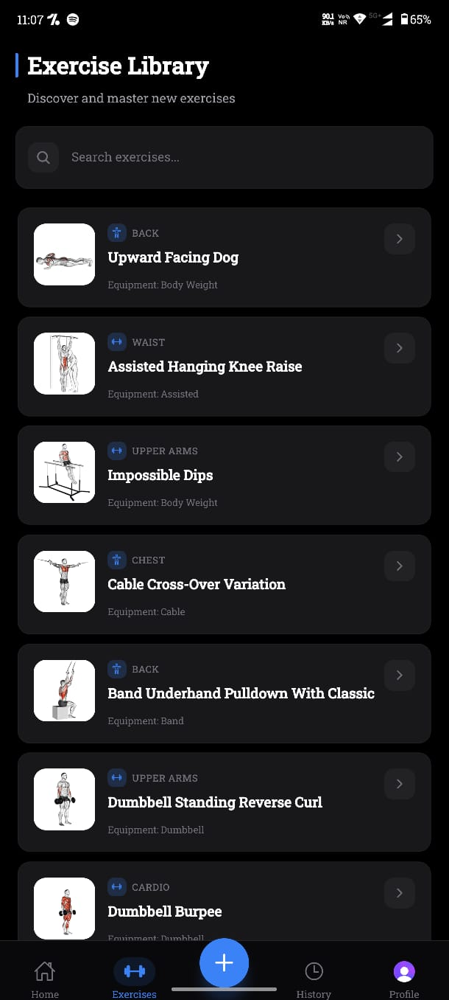
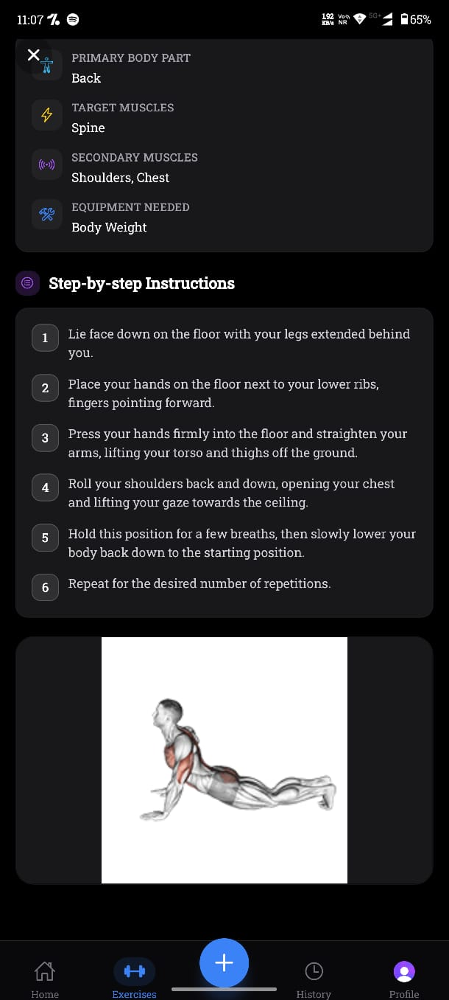
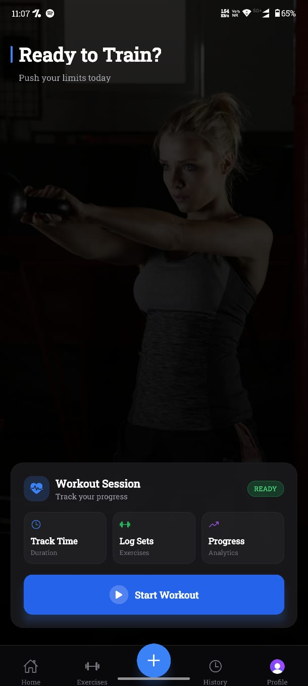
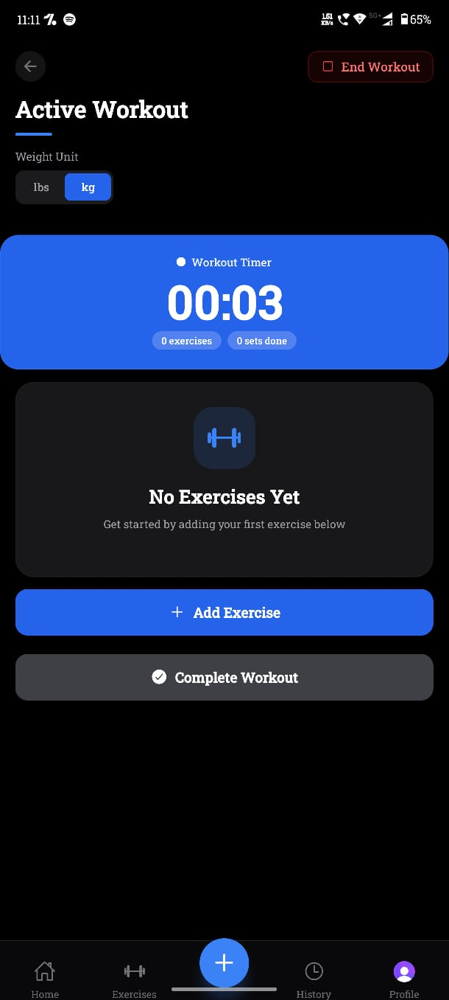
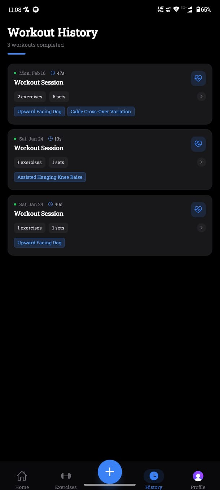
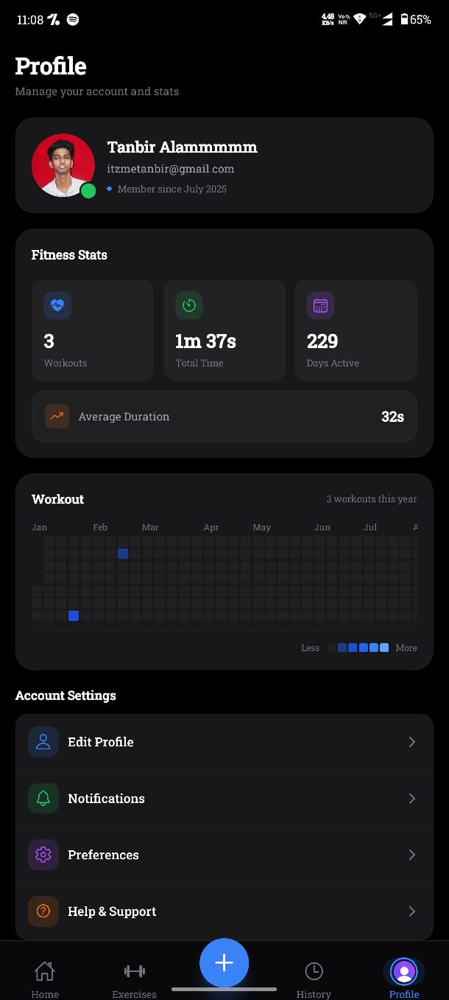
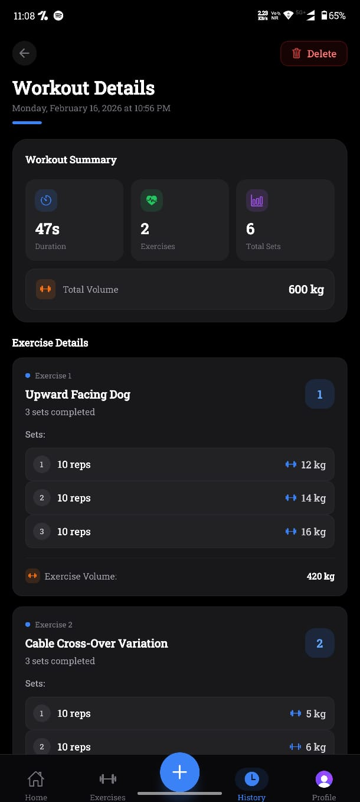
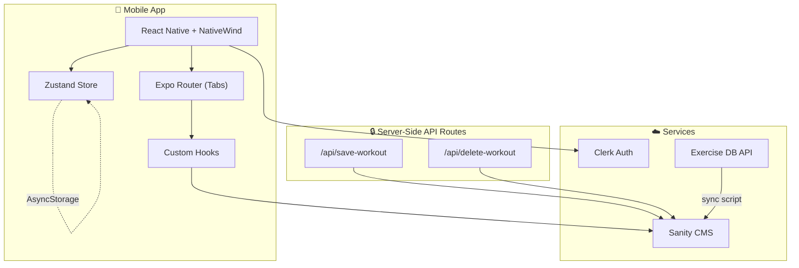

<div align="center">

# 🏋️ FitTracker — Workout Planner

**Build. Track. Improve.**

A cross-platform fitness tracking app powered by React Native and a headless CMS — designed to help you build custom workouts, log every set, and visualize your progress over time.

[](https://expo.dev)
[](https://reactnative.dev)
[](https://typescriptlang.org)
[](https://sanity.io)

</div>

---

## ✨ Features

| Feature                 | Description                                                                                        |
| ----------------------- | -------------------------------------------------------------------------------------------------- |
| **🔐 Authentication**   | Email/password + Google OAuth via Clerk, with protected routes and automatic session management    |
| **📚 Exercise Library** | 1,300+ exercises synced from Exercise DB — filterable by body part, equipment, and difficulty      |
| **🏃 Active Workout**   | Live stopwatch, dynamic set/rep logging, weight unit toggle (lbs/kg), and real-time validation     |
| **📊 Workout History**  | Full session archive with per-exercise volume breakdown, duration stats, and detailed record views |
| **🔥 Heatmap**          | GitHub-style 365-day activity heatmap on the home screen to visualize workout consistency          |

| **👤 Profile** | User profile with avatar, editable details via Clerk, and app preferences |
| **📱 Cross-Platform** | Runs on iOS, Android, and Web from a single Expo codebase |

---

## � Screenshots

<div align="center">

|              Splash Screen              |             Home Dashboard              |            Exercise Library             |
| :-------------------------------------: | :-------------------------------------: | :-------------------------------------: |
|  |  |  |

|             Exercise Detail             |               Workout Tab               |             Active Workout              |
| :-------------------------------------: | :-------------------------------------: | :-------------------------------------: |
|  |  |  |

|             Workout History             |             Workout Details             |            Profile & Heatmap            |
| :-------------------------------------: | :-------------------------------------: | :-------------------------------------: |
|  |  |  |

</div>

---

## �🛠️ Tech Stack

| Layer             | Technology                                                                             |
| ----------------- | -------------------------------------------------------------------------------------- |
| **Framework**     | [Expo](https://expo.dev) (SDK 54) + [React Native](https://reactnative.dev) 0.83       |
| **Routing**       | [Expo Router](https://docs.expo.dev/router/introduction/) (file-based, tab navigation) |
| **Styling**       | [NativeWind](https://www.nativewind.dev/) (Tailwind CSS for React Native)              |
| **State**         | [Zustand](https://zustand-demo.pmnd.rs/) with AsyncStorage persistence                 |
| **Auth**          | [Clerk](https://clerk.com/) (Email + Google OAuth)                                     |
| **Backend / CMS** | [Sanity](https://sanity.io/) (GROQ queries, TypeGen, admin client)                     |

| **Animations** | [React Native Reanimated](https://docs.swmansion.com/react-native-reanimated/) |
| **Language** | TypeScript across the entire codebase |
| **Build / Deploy** | [EAS Build](https://docs.expo.dev/build/introduction/) (development, preview APK, production) |

---

## 📁 Project Structure

```
AI-Workout-Planner/
├── src/
│   ├── app/
│   │   ├── (app)/
│   │   │   ├── (tabs)/
│   │   │   │   ├── index.tsx              # Home — stats, recent workouts, heatmap
│   │   │   │   ├── exercises/
│   │   │   │   │   ├── index.tsx          # Exercise library with search & filters
│   │   │   │   │   └── exercise-detail.tsx # Detail view with instructions
│   │   │   │   ├── workout/
│   │   │   │   │   ├── index.tsx          # Workout builder — add exercises
│   │   │   │   │   └── active-workout.tsx # Live session — timer, sets, save
│   │   │   │   ├── history/
│   │   │   │   │   ├── index.tsx          # Session history list
│   │   │   │   │   └── workout-record.tsx # Detailed workout breakdown
│   │   │   │   └── profile/
│   │   │   │       ├── index.tsx          # User profile & preferences
│   │   │   │       └── editProfile.tsx    # Edit profile details
│   │   │   ├── sign-in.tsx                # Sign in (email + Google)
│   │   │   └── sign-up.tsx                # Sign up with onboarding
│   │   ├── api/
│   │   │   ├── save-workout+api.ts        # POST — persist workout to Sanity
│   │   │   └── delete-workout+api.ts      # POST — remove workout from Sanity
│   │   └── components/                    # Reusable UI components
│   │       ├── WorkoutHeatmap.tsx          # 365-day activity heatmap
│   │       ├── ExerciseCard.tsx            # Exercise list item
│   │       ├── ExerciseSelectionModal.tsx  # Modal for adding exercises
│   │       ├── SetRow.tsx                  # Individual set input row
│   │       ├── TimerDisplay.tsx            # Live workout timer
│   │       ├── WorkoutHeader.tsx           # Active workout header
│   │       ├── GoogleSignIn.tsx            # Google OAuth button
│   │       ├── SplashScreen.tsx            # Animated splash
│   │       └── Loader.tsx                  # Loading spinner
│   ├── hooks/
│   │   ├── useWorkout.ts                  # GROQ-powered workout fetching
│   │   └── useWorkoutHeatmap.ts           # Heatmap data processing
│   └── lib/
│       ├── sanity/
│       │   ├── client.ts                  # Sanity client (public + admin)
│       │   └── types.ts                   # Auto-generated TypeGen types
│       ├── workoutUtils.ts                # Stats, formatting, summaries
│       ├── heatmapUtils.ts                # Date grid & color logic
│       └── utils.ts                       # General utilities
├── store/
│   └── workout-store.ts                   # Zustand store (exercises, sets, unit)
├── sanity/                                # Sanity Studio (standalone)
│   ├── schemaTypes/
│   │   ├── exercise.ts                    # Exercise document schema (16+ fields)
│   │   └── workout.ts                     # Workout document schema (nested sets)
│   ├── sanity.config.ts                   # Studio configuration
│   └── sanity-typegen.json                # TypeGen settings
├── scripts/
│   └── sync.ts                            # Exercise DB → Sanity sync script
├── assets/                                # App icon & images
├── app.json                               # Expo config (iOS, Android, Web)
├── eas.json                               # EAS Build profiles
└── tailwind.config.js                     # NativeWind / Tailwind config
```

---

## 🚀 Getting Started

### Prerequisites

- **Node.js** ≥ 18
- **npm** (comes with Node)
- **Expo CLI** — installed globally or via `npx`
- A [Clerk](https://clerk.com/) account (for auth keys)
- A [Sanity](https://sanity.io/) project (for the content backend)

### 1. Clone & Install

```bash
git clone https://github.com/tanbiralam/AI-Workout-Planner.git
cd AI-Workout-Planner
npm install
```

### 2. Configure Environment

Create a `.env` file in the project root:

```env
# Clerk
EXPO_PUBLIC_CLERK_PUBLISHABLE_KEY=pk_test_...

# Sanity (write-access token)
EXPO_PUBLIC_SANITY_API_TOKEN=sk...


# Exercise DB (optional overrides)
EXPO_PUBLIC_EXERCISE_DB_API_URL=https://v2.exercisedb.dev/api/v1/exercises
EXERCISE_DB_PAGE_SIZE=100
```

### 3. Run the App

```bash
# Start the Expo dev server (choose iOS / Android / Web)
npm start

# Or target a specific platform
npm run ios
npm run android
npm run web
```

### 4. Launch Sanity Studio (optional)

```bash
cd sanity
npm install
npm run dev
```

The Studio opens at `http://localhost:3333` for managing exercises and workouts.

---

## 📡 API Routes

Expo Router's file-based API routes keep secrets server-side:

| Endpoint              | Method | Description                                                     |
| --------------------- | ------ | --------------------------------------------------------------- |
| `/api/save-workout`   | `POST` | Persists a completed workout session to Sanity via admin client |
| `/api/delete-workout` | `POST` | Removes a workout record from Sanity by document ID             |

---

## 🔄 Exercise Sync

Populate your exercise library from the [Exercise DB](https://exercisedb.io/) API:

```bash
npm run sync:exercises
```

- Paginates through the full Exercise DB catalog
- Upserts documents into Sanity by `externalId`
- Respects the `manualOverride` flag — manually curated exercises are skipped
- Requires `EXPO_PUBLIC_SANITY_API_TOKEN` to be set

---

## 📦 Build & Deploy

EAS Build is pre-configured with three profiles:

| Profile       | Purpose                      | Output                       |
| ------------- | ---------------------------- | ---------------------------- |
| `development` | Dev client for local testing | Internal distribution        |
| `preview`     | QA / beta testing            | APK (internal)               |
| `production`  | Release build                | APK (auto-increment version) |

```bash
# Preview APK
npx eas build --profile preview --platform android

# Production build
npx eas build --profile production --platform android
```

---

## 🏗️ Architecture



---

## 🤝 Contributing

1. Fork the repository
2. Create a feature branch: `git checkout -b feature/your-feature`
3. Commit changes: `git commit -m "feat: add your feature"`
4. Push to the branch: `git push origin feature/your-feature`
5. Open a Pull Request

---

## 📄 License

This project is licensed under the [MIT License](LICENSE).

---
